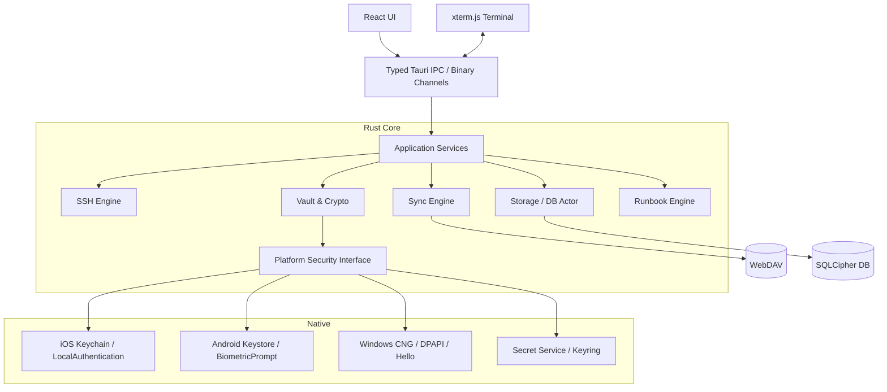

# AnySSH 技术选型与技术方案（2026）

> 基线日期：2026-07-25
> 目标：构建一个开源、端到端加密、跨桌面与移动平台的 SSH 客户端，产品体验接近 Termius Pro，但不复制其商标、素材或受版权保护的界面细节。
>
> 文档角色：总体技术设计。具体架构决策以 `docs/adr/` 中状态为 Accepted 的 ADR 为准；实施顺序以 `docs/execplans/active/` 中的活动计划为准。

## 1. 结论先行

推荐采用以下主架构：

| 领域 | 推荐选型 | 2026 基线 |
| --- | --- | --- |
| 应用壳 | Tauri 2 | 2.11.x |
| 前端 | React + TypeScript + Vite | React 19、Vite 8 |
| UI | Tailwind CSS + Headless 组件 + 自建设计令牌 | 不依赖重型 UI 框架 |
| 终端 | xterm.js | 6.0.x |
| 核心语言 | Rust | 固定最新稳定工具链与 MSRV |
| 异步运行时 | Tokio | 1.x |
| SSH 协议 | russh | 0.62.x |
| 本地数据库 | SQLite + SQLCipher | SQLCipher 4.10.x |
| Rust 数据访问 | rusqlite，单独 DB Actor | 0.40.x |
| 记录级加密 | XChaCha20-Poly1305 | RustCrypto |
| PIN/同步密码 KDF | Argon2id | RFC 9106 |
| 子密钥派生 | HKDF-SHA-256 | 独立用途、独立上下文 |
| 同步 | 自定义 E2EE 操作日志 + WebDAV 适配器 | RFC 4918/6578 |
| 序列化 | 规范化 CBOR | `minicbor` 或等价实现 |
| 原生安全能力 | 自定义 Tauri 平台插件 | Swift/Kotlin/Windows CNG/Linux Secret Service |

核心原则：

1. **UI 可以跨平台，秘密必须留在 Rust/原生层。**
2. **不直接同步 SQLite 数据库文件。**
3. **本地整库加密与敏感字段二次加密同时存在。**
4. **生物识别不是加密密钥，只用于授权使用设备密钥。**
5. **优先纯 Rust、Apache/MIT/BSD/MPL 依赖，避免移动端 LGPL/GPL 分发风险。**
6. **SSH、同步、存储、平台安全全部通过接口隔离，避免被单个库锁死。**

---

## 2. 为什么选择 Tauri 2，而不是 Flutter、Electron 或 Compose Multiplatform

### 推荐：Tauri 2 + React + Rust

优势：

- 同一套 UI 可覆盖 Linux、Windows、Android、iOS。
- SSH、加密、同步、数据库全部可以留在 Rust 内核中。
- xterm.js 是成熟的 Web 终端实现，生态和兼容性优于多数跨平台原生终端控件。
- 相比 Electron，不需要捆绑完整 Chromium，安装包和内存占用通常更小。
- Tauri 的 capability/permission 模型适合限制 WebView 能访问的原生接口。
- Linux 基于 GTK/WebKitGTK，可运行于 X11，也可通过 GTK Wayland 后端运行于 Wayland。

主要风险：

- Linux WebKitGTK 在部分 GPU、NVIDIA、Wayland 组合上可能出现渲染问题。
- iOS/Android WebView 的输入法、软键盘、WebGL 上下文丢失需要专项处理。
- Tauri 移动端插件生态不如 Flutter，因此密钥环和生物识别应自行实现原生插件。

规避方案：

- xterm.js 同时准备 WebGL 与非 WebGL 渲染路径。
- 建立 X11、Wayland、Windows、Android、iOS 的真实设备测试矩阵。
- 将终端封装为 `TerminalAdapter`，未来可替换成 `libghostty`。
- 第一阶段必须做跨平台技术验证，不应直接开始堆业务页面。

### 不推荐作为主方案

| 方案 | 不作为首选的原因 |
| --- | --- |
| Electron | 桌面成熟，但不覆盖 iOS/Android，且资源占用高 |
| Flutter | 移动体验优秀，但 Rust FFI、终端生态和 Linux 图形兼容测试成本更高 |
| Compose Multiplatform | iOS 已稳定，但高质量 SSH 终端控件和 Rust 双向桥接仍会增加工程复杂度 |
| Qt/QML | 平台成熟，但 C++/Rust 双栈、移动端分发及 LGPL 合规成本较高 |
| React Native | Windows/Linux/iOS/Android 实际上不是同一成熟度的一套运行时 |

---

## 3. 总体架构



### 分层规则

- React 不直接访问 SQLite、WebDAV、SSH 私钥或平台密钥环。
- 前端只持有页面状态、非敏感展示模型和终端字节流。
- 所有业务命令通过生成类型的 IPC 调用。
- 密码、私钥明文不得进入 Redux/Zustand 全局状态、日志、错误对象或遥测。
- SSH 输出使用二进制通道，不要把每个数据块编码为 JSON/Base64。

---

## 4. Rust Workspace 模块划分

建议从第一天就按可测试的核心库拆分：

```text
anyssh/
├── apps/
│   └── client/
│       ├── src/                  # React UI
│       └── src-tauri/            # Tauri 壳与 IPC
├── crates/
│   ├── anyssh-domain/            # Host、Group、Credential 等领域模型
│   ├── anyssh-app/               # 用例编排
│   ├── anyssh-ssh/               # SSH、Jump、Forward、Agent
│   ├── anyssh-vault/             # 密钥层次与敏感数据加密
│   ├── anyssh-storage/           # SQLCipher、迁移、Repository
│   ├── anyssh-sync/              # 操作日志、合并、压缩
│   ├── anyssh-sync-webdav/       # WebDAV Provider
│   ├── anyssh-script/            # Snippet/Runbook
│   ├── anyssh-platform/          # 平台安全 trait
│   └── anyssh-testkit/           # SSH/WebDAV 测试工具
├── native/
│   ├── android/
│   ├── ios/
│   ├── windows/
│   └── linux/
└── docs/
    ├── threat-model.md
    ├── sync-format.md
    └── adr/
```

不要在 Tauri command 中直接写业务逻辑。Tauri 层只负责：

- 参数校验与类型转换。
- 权限与会话检查。
- 调用 application service。
- 将事件、结果和错误转换为稳定 IPC 协议。

---

## 5. SSH 技术方案

### 5.1 SSH 引擎：russh

2026 年推荐 `russh` 而不是 `libssh/libssh2`：

- Apache-2.0，适合桌面和 App Store 分发。
- Rust 原生异步模型，能直接接入 Tokio。
- 支持现代 OpenSSH 使用的混合后量子密钥交换
  `mlkem768x25519-sha256`。
- 支持 Curve25519、ChaCha20-Poly1305、AES-GCM、SHA-2。
- 支持密码、公钥、keyboard-interactive、OpenSSH Agent。
- 支持 `direct-tcpip`、远程转发、Agent Forwarding。
- 支持 Unix Agent Socket 和 Windows OpenSSH Agent Named Pipe。
- 可以在一个 SSH Channel 上继续建立下一跳 SSH 连接。

仍需做的工程工作：

- 封装连接、认证、重连和状态机，不让上层直接依赖 russh API。
- 对 SSH 输出建立有界队列和背压。
- 为 Jump Host 实现 `AsyncRead + AsyncWrite` Channel Stream 适配。
- 对 OpenSSH、Dropbear 和旧设备建立兼容测试。
- 上线前对核心封装做独立安全审计。

### 5.2 加密算法策略

默认“现代安全”配置：

- KEX：
  1. `mlkem768x25519-sha256`
  2. `curve25519-sha256`
  3. 必要的 SHA-2 DH 兼容项
- Host Key：
  1. Ed25519
  2. ECDSA P-256/P-384
  3. RSA-SHA2-512/256
- Cipher：
  1. ChaCha20-Poly1305
  2. AES-256-GCM
  3. AES-128/256-CTR + Encrypt-then-MAC
- 默认禁用 SHA-1、DSA、CBC 和过时 DH Group。

旧设备需要单独的“兼容模式”：

- 只能针对单个 Host 打开。
- 打开前显示风险提示。
- UI 明确显示本次协商使用了弱算法。
- 不提供“一键全局允许所有旧算法”。

### 5.3 Host Key 校验

必须实现：

- 首次连接 TOFU 确认。
- 展示 SHA-256 指纹、Key Type、Host 和 Port。
- Host Key 变化时硬阻断，不自动接受。
- 加密保存 known-hosts 数据。
- 支持导入、导出 OpenSSH `known_hosts`。
- 支持同一地址的多个端口和经 Jump Host 访问的目标。

### 5.4 认证方式

MVP 支持：

- 用户名 + 密码。
- Keyboard-interactive，兼容 OTP/MFA。
- OpenSSH 私钥。
- 加密私钥及其 passphrase。
- 系统 SSH Agent。
- 应用内置 Agent。

后续支持：

- OpenSSH 用户证书。
- FIDO2/Security Key，通过系统 Agent 或平台 External Signer 接入。
- PKCS#11 智能卡。

### 5.5 Jump Host

不要通过启动系统 `ssh` 子进程实现。

连接链路：

```text
TCP/Proxy -> Jump 1 SSH
           -> direct-tcpip channel -> Jump 2 SSH
              -> direct-tcpip channel -> Target SSH
```

每一跳拥有独立配置：

- Host Key 校验。
- Credential。
- 超时与 Keepalive。
- 上游 HTTP CONNECT/SOCKS5 Proxy。

Jump Route 使用有序列表存储，并在保存时检测循环引用。

### 5.6 Proxy 与端口转发

需要区分两类 SOCKS：

1. **连接 SSH Server 时使用的上游代理**
   - SOCKS5
   - HTTP CONNECT

2. **SSH 连接建立后暴露的动态转发**
   - 本地 SOCKS5 Server
   - 每个 CONNECT 请求映射到 `direct-tcpip`

MVP 转发能力：

- Local Forward：`-L`
- Remote Forward：`-R`
- Dynamic SOCKS5：`-D`
- IPv4、IPv6、域名目标
- 动态 SOCKS 默认只支持 CONNECT，不支持 UDP ASSOCIATE

安全默认值：

- 本地监听默认绑定 `127.0.0.1`/`::1`。
- 绑定 `0.0.0.0`、局域网或公网地址时二次确认。
- Agent Forwarding 默认关闭。
- Remote Forward 明确展示服务端实际监听地址。

### 5.7 SSH Agent

桌面：

- Linux：`SSH_AUTH_SOCK`
- Windows：OpenSSH Agent Named Pipe
- Pageant：作为后续兼容适配器

移动端通常没有通用系统 SSH Agent，因此提供应用内 Agent：

- 私钥只在 Rust Vault 中解密。
- Agent 只暴露签名，不暴露私钥。
- 可配置每次签名确认、会话有效期和自动锁定。
- Agent Forwarding 提示“远端管理员可能在连接期间调用 Agent”。

---

## 6. Host、Group 与继承模型

Group 不应只是 UI 文件夹，而应是配置继承节点。

推荐优先级：

```text
Application Default
  -> Root Group
    -> Parent Group
      -> Child Group
        -> Host Override
```

每个可继承字段必须使用三态，而不是普通 `Option<T>`：

```rust
enum Override<T> {
    Inherit,
    Set(T),
    Clear,
}
```

否则无法表达“父组设置了 Proxy，但当前 Host 明确不使用 Proxy”。

建议领域对象：

```text
Host
Group
Credential
SshKey
JumpRoute
ProxyProfile
PortForwardRule
TerminalProfile
Theme
FontProfile
Script
Runbook
SyncProfile
KnownHost
```

Host 只保存对 Credential/Key/Route 的 ID 引用，不复制密码或私钥。

---

## 7. 终端与 UI

### 7.1 xterm.js 6

首发使用：

- `@xterm/xterm`
- WebGL Renderer
- Fit
- Search
- Web Links
- Unicode Grapheme
- Ligatures

渲染策略：

1. Windows/Linux 优先 WebGL。
2. WebGL 初始化失败或 Context Lost 时自动切换备用 Renderer。
3. 移动端根据设备能力决定是否启用 WebGL。
4. 终端实例不因切换 Tab 而销毁，使用 LRU 控制后台实例数量。

2026 年的 `libghostty` 已很有潜力，但其 C API 仍处于演进阶段。因此：

- 设计 `TerminalAdapter` 接口。
- MVP 不直接绑定 `libghostty`。
- 后续可试验 `libghostty-vt`/WASM 后端。

### 7.2 终端数据通道

禁止：

- 每个字节块单独触发 Tauri Event。
- Base64 包装大量终端输出。
- 无上限缓存滚屏或 SSH 输出。

建议：

- Rust 每次聚合 16–64 KiB。
- 每 4–8 ms 或达到阈值后批量发送。
- 使用 Tauri binary channel/等价二进制 IPC。
- 前端调用 `terminal.write(Uint8Array, callback)`。
- 排队数据超过阈值时暂停 SSH Channel 读取。
- Scrollback 默认 10,000 行，可配置并设置硬上限。

### 7.3 字体与 Unicode

必须支持：

- 用户选择系统字体。
- 导入 `.ttf`、`.otf`、`.ttc`、`.woff2`。
- Nerd Font/Powerline Symbols。
- Emoji、组合字符、ZWJ、CJK Wide Character。
- 连字开关。
- East Asian Ambiguous Width 的窄/宽模式。

建议默认字体链：

```css
JetBrains Mono,
Symbols Nerd Font Mono,
Noto Sans Mono CJK,
Noto Color Emoji,
monospace
```

注意：

- 不要依赖 WebView 的 `queryLocalFonts`。
- 桌面端由 Rust 使用系统字体 API/`fontdb` 枚举字体。
- 通过受限的自定义协议把选定字体暴露给 WebView。
- 移动端以系统字体和少量内置 OFL 字体为主。
- 需要建立 Nerd Font、中文、日文、Emoji、组合音标的视觉回归测试集。

### 7.4 移动端终端输入

移动端必须单独设计，而不是缩小桌面 UI：

- 键盘辅助栏：Esc、Ctrl、Alt、Tab、方向键、Home/End、PgUp/PgDn。
- Ctrl/Alt 组合键锁定。
- F1–F12 二级面板。
- 可配置滑动手势。
- 硬件键盘完整映射。
- IME composition 期间不提前发送半成品文本。
- 粘贴多行命令时显示 bracketed-paste 风险提示选项。

---

## 8. 本地加密 Vault

### 8.1 威胁目标

主要防护：

- 设备丢失但应用处于锁定状态。
- 其他普通权限应用读取应用文件。
- WebDAV 服务端读取同步内容。
- 日志、崩溃报告和剪贴板意外泄露。

无法完全防护：

- 已 root/jailbreak 的设备。
- 具有管理员、内核或进程注入能力的恶意软件。
- 用户主动显示、复制或导出秘密。
- 已被控制的远程 SSH Server。
- Linux 上所有桌面环境中的截屏/录屏。

### 8.2 密钥层次

```text
Random Vault Master Key (VMK, 256-bit)
├── HKDF("db")       -> SQLCipher DB Key
├── HKDF("record")   -> Record Encryption Root
├── HKDF("sync")     -> Sync Encryption Root
├── HKDF("backup")   -> Backup Encryption Root
└── HKDF("index")    -> Opaque ID / Index Key
```

VMK 永不直接写入磁盘，只保存多个加密 Key Slot：

```text
VMK
├── Platform Slot  -> OS hardware/keychain protected key
├── PIN Slot       -> Argon2id(PIN) derived KEK
├── Sync Slot      -> Argon2id(sync passphrase) derived KEK
└── Recovery Slot  -> Recovery key derived KEK
```

更改 PIN 或同步密码时只需要重包 VMK，不需要重新加密全部数据。

### 8.3 加密算法

- 数据库：SQLCipher 4.10，随机 256-bit DB Key。
- 敏感字段：XChaCha20-Poly1305。
- 子密钥：HKDF-SHA-256。
- PIN/同步密码：Argon2id。
- 随机数：操作系统 CSPRNG。
- 内存：`zeroize`/`secrecy`，必要时 best-effort memory lock。

Argon2id 参数不要硬编码为所有设备相同：

- 首次初始化时做设备性能校准。
- 目标解锁耗时约 300–700 ms。
- 移动端尽可能使用至少 64 MiB 内存。
- 记录算法版本和参数，便于未来升级。
- 不使用当前仍为 RC 的密码学 crate 版本。

### 8.4 SQLCipher 使用方式

- 使用 `rusqlite`，数据库运行在单独 DB Actor 线程。
- 所有写操作串行化，避免到处持有 Connection。
- DB Key 从 VMK 派生，不使用用户 PIN 直接作为数据库密码。
- WAL、Journal、临时页必须保持加密。
- 开启 SQLCipher memory security 能力并进行性能测试。
- Schema migration 必须支持中断恢复。
- 自动备份同样使用独立加密格式。

除以下最小 bootstrap 信息外，不落地任何明文业务数据：

- Vault 格式版本。
- KDF Salt 和参数。
- 加密 Key Slot。
- 随机 Vault ID。

不得在 bootstrap 中保存 Host、用户名、WebDAV URL、分组名或脚本名。

### 8.5 平台解锁

统一接口：

```rust
trait PlatformKeyProtector {
    async fn create_slot(&self, policy: UnlockPolicy) -> Result<KeySlot>;
    async fn unwrap(&self, slot: &KeySlot, reason: &str) -> Result<SecretKey>;
    async fn delete_slot(&self, slot_id: SlotId) -> Result<()>;
}
```

平台实现：

#### iOS

- Keychain。
- `LocalAuthentication`。
- 使用 `userPresence` 或 `biometryCurrentSet` Access Control。
- 生物信息变化导致 Slot 失效时，使用 PIN/Recovery Slot 恢复。
- 不保存 Face ID/Touch ID 生物数据。

#### Android

- Android Keystore。
- AES-GCM Hardware-backed Key。
- `BiometricPrompt`。
- 可用时使用 StrongBox，失败时回退 TEE。
- 配置用户认证有效期和生物信息变化后的失效策略。

#### Windows

- 优先 TPM/CNG 或 Windows Hello 支持的持久化密钥。
- DPAPI User Scope 作为兼容回退。
- Windows Hello 负责 step-up authorization，不把 PIN 交给应用。

#### Linux

- Secret Service/libsecret，兼容 GNOME Keyring/KWallet。
- 无 Secret Service 时要求使用本地 PIN/Passphrase Slot。
- 不假设 Linux 一定存在可靠的系统生物识别解锁。

### 8.6 密码可见功能

满足“允许查看密码”，但必须：

- 默认掩码。
- 查看前可要求再次生物识别/PIN。
- 30 秒后自动隐藏。
- 不进入全局前端状态和日志。
- 前端页面切换、应用进入后台时立即隐藏。
- 复制后定时清理剪贴板，并提示系统剪贴板历史无法完全控制。
- 私钥导出必须再次认证，并默认以加密 OpenSSH 格式导出。

---

## 9. WebDAV 端到端加密同步

### 9.1 不同步数据库文件

严禁把 SQLCipher DB 作为一个文件直接上传：

- 两台设备同时修改会产生整文件冲突。
- 移动端中断上传可能留下损坏文件。
- 无法做字段级合并。
- 无法安全处理删除、重命名和离线编辑。

推荐使用“不可变操作日志 + 快照”。

### 9.2 WebDAV 目录布局

示例：

```text
/anyssh-v1/
├── vault-header.bin
├── devices/
│   └── <opaque-device-id>/
│       ├── head.bin
│       └── ack.bin
├── ops/
│   └── <opaque-device-id>/
│       ├── 0000000000000001.bin
│       └── 0000000000000002.bin
├── snapshots/
│   └── <snapshot-id>.bin
└── blobs/
    └── <ciphertext-hash>.bin
```

原则：

- Operation 文件不可变，每台设备只写自己的目录。
- `head.bin` 使用 ETag + `If-Match` 做 CAS。
- 服务端支持 DAV Sync Collection 时使用增量同步。
- 不支持时回退到 `PROPFIND`。
- 文件名使用 HMAC/随机不透明 ID，避免泄露 Host 名。
- 服务端仍能观察文件数量、大小和时间；不能宣称隐藏全部元数据。

### 9.3 Operation 格式

明文逻辑结构：

```text
op_id
device_id
sequence
hybrid_logical_clock
entity_type
entity_id
operation
field_patch
previous_op_hash
schema_version
```

序列化后整体 AEAD 加密：

- Nonce 每个 Operation 随机生成。
- AAD 包含 Vault ID、格式版本和对象类型。
- 每台设备形成 Hash Chain。
- 本地保存最近同步检查点，用于发现服务端回滚。

限制：

- 恶意 WebDAV 服务端仍可以删除数据或对全新设备展示旧快照。
- 在没有独立透明日志/账号服务器的前提下，无法完全阻止针对新设备的回滚。
- 产品文档必须如实说明这个边界。

### 9.4 冲突合并

使用 Hybrid Logical Clock（HLC）和 Device ID 做确定性排序。

| 数据类型 | 合并策略 |
| --- | --- |
| Host 普通字段 | 字段级 LWW Register |
| Group Parent | LWW，合并后检测并修复环 |
| 排序 | Fractional Position Key |
| Password/Private Key | 原子更新；并发时保留冲突副本 |
| Script 文本 | MVP 原子更新；并发时创建 Conflict Copy |
| 删除 | Tombstone，压缩前保留 |

不建议一开始引入通用 CRDT 框架。数据模型较小，自定义有限 CRDT/LWW 更容易审计和迁移。

### 9.5 新设备加入

流程：

1. 用户输入 WebDAV URL、用户名和密码。
2. 下载 `vault-header.bin`。
3. 用户输入同步密码或 Recovery Code。
4. Argon2id 派生 KEK，解开 VMK。
5. VMK 再由新设备平台密钥和本地 PIN 包装。
6. 下载快照和后续 Operation。

WebDAV 凭据本身不应作为唯一恢复手段。忘记同步密码且所有已授权设备都丢失时，数据不可恢复。

### 9.6 Provider 接口

```rust
trait SyncObjectStore {
    async fn list(&self, prefix: &str, cursor: Option<&str>) -> Result<Page>;
    async fn get(&self, key: &str) -> Result<Object>;
    async fn put_if_absent(&self, key: &str, body: Bytes) -> Result<PutResult>;
    async fn compare_and_swap(
        &self,
        key: &str,
        expected_etag: &str,
        body: Bytes,
    ) -> Result<CasResult>;
    async fn delete(&self, key: &str, expected_etag: Option<&str>) -> Result<()>;
}
```

未来增加 S3、自托管 API、Local Folder 时，不需要改同步合并层。

---

## 10. 脚本管理

第一阶段不要提供任意本地 JavaScript/Rust 插件执行能力，这会显著扩大秘密泄露面。

建议先提供两类：

### Snippet

- 一段可发送到当前终端的命令。
- 支持变量。
- 多行粘贴确认。

### Runbook

- 有序步骤。
- `exec`：新建 SSH exec channel。
- `send`：发送到当前 PTY。
- `wait`：等待固定文本或受限正则。
- `prompt`：要求用户输入。
- `confirm`：高风险步骤前确认。
- `secret`：由 Rust Core 注入，前端看不到实际值。

批量组执行：

- 设并发上限。
- 默认 dry-run 展示目标 Host。
- 危险命令二次确认。
- 每台 Host 单独记录状态。
- 输出日志默认加密，并支持关闭持久化。

以后如需真正脚本语言，可评估沙箱化 Rhai/Starlark；不要使用 `eval`，也不要默认允许本地 Shell。

---

## 11. UI 与产品结构

建议布局：

```text
Desktop
┌────────────┬──────────────────────────────┐
│ Hosts      │ Session Tabs                 │
│ Groups     ├──────────────────────────────┤
│ Keys       │                              │
│ Scripts    │          Terminal            │
│ Forwards   │                              │
│ Sync       │                              │
└────────────┴──────────────────────────────┘
```

移动端：

- 底部导航：Hosts、Sessions、Keys、Scripts、Settings。
- Host 编辑采用分段页面，不照搬桌面双栏。
- Terminal 全屏优先。
- Jump、Forward、Credential 使用独立可复用对象。

主题系统：

- CSS Variables + Design Tokens。
- App Theme 与 Terminal Theme 分开。
- Light/Dark/System。
- 主题 JSON 带 `schemaVersion`。
- 禁止主题包执行脚本或加载远程资源。

---

## 12. 平台约束

### Linux

- 同时测试 X11 与原生 Wayland Session。
- WebKitGTK 必须准备软件/非 WebGL 回退。
- 支持 Secret Service 不等于所有发行版都已配置 Keyring。
- 分发优先：Flatpak、AppImage，之后补 deb/rpm。
- Flatpak 下访问 SSH Agent、字体和 Keyring 需要 Portal/权限专项测试。

### Windows

- 目标 Windows 10/11，使用 WebView2。
- 支持 OpenSSH Agent Named Pipe。
- 安装包和自动更新必须签名。
- 私钥文件 ACL 限制当前用户。

### Android

- 长时间后台 SSH/Tunnel 需要 Foreground Service 和常驻通知。
- 应用进入后台后是否继续连接应由用户配置。
- 后台限制和应用商店政策必须纳入设计。

### iOS

- 不承诺应用在后台长期维持任意 SSH 连接或 Tunnel。
- 进入后台后保存 UI 状态；恢复时重连或提示连接已断开。
- WebDAV 后台同步只能作为 best-effort，前台解锁时必须再次同步。
- 访问局域网 SSH Server 时正确处理 Local Network 权限。

---

## 13. 安全工程要求

### WebView

- 严格 CSP，禁止远程脚本、`eval` 和任意导航。
- Release 禁用 DevTools。
- Tauri capability 按窗口、命令最小授权。
- 外部链接只交给系统浏览器。
- HTML/ANSI 链接不允许直接调用原生命令。
- 所有 IPC 参数在 Rust 侧再次校验。

### 日志

- Rust 使用 `tracing`，增加秘密字段自动脱敏层。
- 密码、私钥、Token、WebDAV Authorization Header 永不记录。
- Terminal 内容默认不进入诊断日志。
- 崩溃上传必须 opt-in，并在本地先脱敏。

### 供应链

- 提交 Cargo.lock 和 pnpm lockfile。
- `cargo audit`、`cargo deny`、许可证检查。
- npm 依赖审计。
- 生成 CycloneDX SBOM。
- Renovate/Dependabot 只自动提交，不自动合并密码学和 SSH 依赖。
- Release 构建使用固定工具链和可追溯构建环境。

### 测试

- SSH：
  - 当前 OpenSSH。
  - 老版本 OpenSSH。
  - Dropbear。
  - 密码、MFA、Key、Agent、Jump、三类 Forward。
- WebDAV：
  - Nextcloud。
  - ownCloud。
  - nginx WebDAV。
  - Synology/常见 NAS。
  - 不支持 ETag、弱 ETag、错误 MOVE/PROPFIND 实现。
- UI：
  - X11、Wayland、Windows。
  - Android 真机。
  - iPhone/iPad 真机。
- Fuzz：
  - Sync Operation 解码。
  - SOCKS5/HTTP CONNECT Parser。
  - known_hosts 导入。
  - Key 导入。
  - IPC 参数。

稳定版发布前必须完成：

- 威胁模型评审。
- 密钥恢复演练。
- WebDAV 冲突与回滚演练。
- 独立渗透测试/安全审计。

---

## 14. 推荐开发阶段

### Phase 0：技术风险验证

必须先证明：

- Tauri 同一仓库可构建 Linux、Windows、Android、iOS。
- xterm.js 大输出不阻塞 UI。
- Wayland/X11/WebGL 回退可用。
- russh 能完成密码、Key、Agent 和 ML-KEM KEX。
- 两跳 Jump 可通过 SSH Channel 建立。
- SQLCipher 能在四个平台稳定编译和迁移。
- 原生生物识别插件能解包随机 VMK。

### Phase 1：桌面可用 MVP

- Host/Group/继承。
- 密码、私钥、系统 Agent。
- known_hosts。
- 多 Tab Terminal。
- Jump Host。
- Local/Remote/Dynamic Forward。
- Key 生成和导入。
- Theme/Font。
- Snippet。
- 加密本地 Vault。

### Phase 2：E2EE WebDAV

- Vault Header。
- Operation Log。
- 快照。
- HLC 合并。
- 冲突副本。
- 新设备恢复。
- Nextcloud/ownCloud/NAS 兼容测试。

### Phase 3：Android/iOS

- 移动端导航与键盘辅助栏。
- Keystore/Keychain/Biometric。
- 生命周期与自动锁。
- 网络切换、断线恢复。
- App Store/Play Store 发布流程。

### Phase 4：高级能力

- SFTP。
- OpenSSH Certificate。
- FIDO2/PKCS#11。
- 批量 Runbook。
- 导入 OpenSSH Config。
- 更多 Sync Provider。
- 可选 `libghostty` Terminal Backend。

---

## 15. 关键 ADR

项目开始时应固定以下 Architecture Decision Records：

1. **ADR-001：Tauri 2 + React 作为统一 UI 壳。**
2. **ADR-002：russh 作为默认 SSH Engine。**
3. **ADR-003：SQLCipher + Record AEAD 双层本地加密。**
4. **ADR-004：WebDAV 同步不可变操作日志，而不是数据库文件。**
5. **ADR-005：VMK 多 Key Slot，生物识别只负责授权解包。**
6. **ADR-006：前端不得长期持有秘密。**
7. **ADR-007：默认现代 SSH 算法，Legacy 仅按 Host 开启。**
8. **ADR-008：不在 MVP 中支持任意插件/本地脚本执行。**

---

## 16. 许可证决策

已确认：

- 主项目源代码和项目文档使用 `AGPL-3.0-only`。
- 第三方依赖、字体和素材继续使用各自许可证，并保留许可证声明。
- 新依赖必须与 AGPLv3 兼容；优先采用 Apache-2.0、MIT、BSD、ISC 等许可证。
- iOS、Windows 商店及其他受额外分发条款约束的平台在公开发布前需要专门的
  许可证合规评估。

同时注意：

- 不使用 Termius 名称作为项目名。
- 不复制其 Logo、图标、截图和逐像素布局。
- 可以实现同类工作流和通用交互模式。

---

## 17. 2026 技术基线说明

截至 2026-07-25 核验的关键变化：

- Tauri 2 已同时覆盖桌面与 Android/iOS，当前 Rust crate 为 2.11 系列。
- xterm.js 当前主版本为 6.0。
- OpenSSH 10.x 默认强调混合后量子密钥交换；SSH 客户端不应再只实现传统 Curve25519。
- russh 0.62 系列已把 `mlkem768x25519-sha256` 放入安全 KEX 顺序。
- SQLCipher 4.10 已于 2026 年发布，应以 4.10 最新补丁版作为基线。
- Ghostty 1.3 已推出跨平台 `libghostty` 方向，但 C API 仍适合评估而非作为 MVP 唯一依赖。

具体 patch 版本通过 lockfile 固定，并由自动化依赖更新工具持续提交升级 PR；架构文档不应依赖某一个 patch 版本永久不变。
